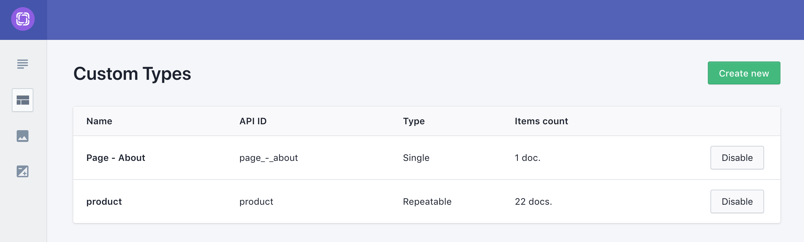
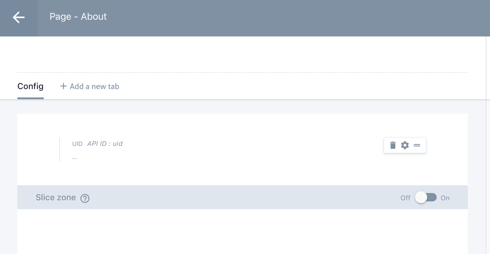
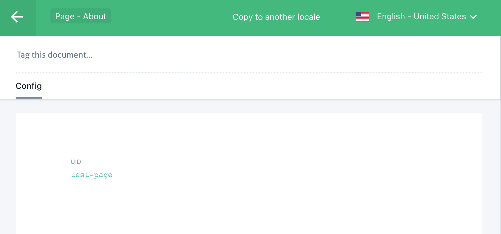

# gatsby-source-prismic-with-magic

Source plugin for getting data from prismic and create magic stuff

## install
```sh
yarn add gatsby-source-prismic-with-magic
```

## Why I've created this

The idea behind this plugin was to create a boilerplate tool to automatically create pages with data pre-fetched from Prismic on gatsby build time.

**This Plugin do not overide the need of `gatsby-source-plugin` or similar if you still want to use graphql to populate regular pages or components!**

## How it works

Pretty simple, you just need to pass some properties to the plugin and create couple of files in some especific places and the magic will happen :-)

1. Add options to the plugin:

```javascript
// ./gatsby-config.js
module.exports = {
  plugins: [
    {
      options: {
        langs: {
          'en-us': {
            default: true,
            locale: 'English',
            path: 'en'
          },
          'pt-pt': {
            locale: 'Português',
            path: 'pt'
          }
        },
        layoutsKey = 'page_-_',
        layoutsPath = 'src/layouts',
        repositoryName: 'my-repository',
      },
      resolve: `gatsby-source-prismic-with-magic`
    }
  ]
}
```

2. Create your model and add the document to Prismic:

Create your model


Add the mandatory field to your document


Create the document


3. Then just create your component with the the name as in your Prisimc model:
```javascript
// Important to use this structure
//  `./${layoutsPath}/${parsedDocumentName}/${parsedDocumentName}.js`
// ./src/layouts/About/About.js
import React from 'react';

const about = ({ pageContext }) => {
  const { document } = pageContext

  return <div>{document.uid}</div>;
};

// Important to export as default
// because this component will be
// used by gatsby to create the page
export default about;
```

4. Now you just need to add fields in your Prismic model, add data in your document and use it in your component...

## Options

It's important to understand how the plugin works in order to handle the data that's passed to your page components:

- **Access Token**

default value: `null`

Your Prismic Access Token if you don't have your API public.

- **langs**

default: `null`

This will be one very important option to use, if you will have multilanguage in your website, since this is used to compose the paths to the pages.

It's mandatory to match the keys of the object with the languages that you've set in Prismic. Usally I use this file externaly because it sets options in other places of my apps.

ex:
```javascript
module.exports = {
  'en-us': {
    default: true,
    locale: 'English',
    path: 'en'
  },
  'pt-pt': {
    locale: 'Português',
    path: 'pt'
  }
};
```

- **layoutsKey**

default value: `page_-_`

This is the prefix of your Prismic pages and needs to match your layouts names:

ex:
if you create a model and give the name `Page About` Prismic will add `page_-_about` as name to that model. Since the plugin will remove the prefix you set here, you just need to have the component `About` in the `./${layoutsPath}/About/About.js` path exported as default.

- **layoutNameExceptions**

default value: `{}`

This is a tricky field, but already happened to have a weird document name in Prismic like: `Page - 10 Reasons Why`, this will have the name: `page_-_10_reasons_why`. So, for me to have the respective component I should create `./${layoutsPath}/10reasonsWhy/10reasonsWhy.js` - since it's a bad practice to have a component filename starting with a number, I just need to add `layoutNameExceptions: { '10': 'Ten' }` and then I may have my component `./${layoutsPath}/TenReasonsWhy/TenReasonsWhy.js`

You should use this carefully since you may find your self having troubles when creating other page + component with a name like: `Page - My 10 reasons` and the plugin will try to find `./${layoutsPath}/MyTenReasons/MyTenReasons.js`

- **layoutsPath**

default value: `src/layouts`

This is the path to your page layout components

- **onCreatePage**

default value: `null`

This is one of the 3 functions that allows to control the data that's passed to your page components. This function runs on every page that's created via the plugin. The function have one argument (object) containing the `document` object, the `documents` array and all the data that's passed via the `onCreatePages` pages.

You may create a specific function for each page, for that you just need to add a file `onCreatePage.js` that exports a function that returns an object (it will extend the previous function return object) in the same folder of your page component.

Example:
```javascript
// ./src/layouts/About/onCreatePage.js
module.exports = ({ document }) => {
  return {
    document: {
      ...document
      myNewField: 'some value'
    }
  }
}
```

- **onCreatePages**

default value: `null`

This is the first function and it runs once, on the build time. Here you can get for example common data to pass to your component, since the returned object will be added to the pageContext. This function will receive an object as argument with the `documents` array.

Example:
```javascript
// ./gatsby-onCreatePages.js
module.exports = ({ documents }) => {
  const common = documents.reduce((acc, doc) => doc.type === 'website_menus' ? {...acc, ...doc} : acc , {});

  return {
    common
  }
}
```

- **repositoryName** (required)

default value `null`

Your Prismic repository name.

## Extra stuff

To complement this plugin I've created a set of tools for `React` + `Prismic` like a `Preview` high order component and a couple of simple render components.

Feel free to use:
[prismic-react-tools](https://github.com/kabalpt/prismic-react-tools)